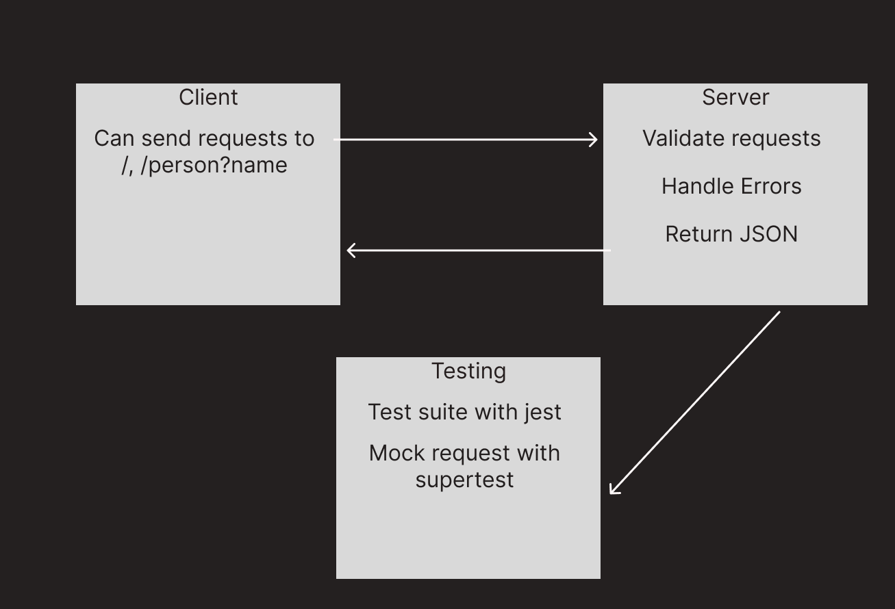

# cloud-server (LAB 16)

## Project: Deploy to AWS

### Author: Tyler Bennett

### Problem Domain  

Practice deploying a server to AWS

### Links and Resources

- [ci/cd](https://github.com/tyler-bennett52/cloud-server/actions) (GitHub Actions)
- [back-end server GUI deployed](http://awspracticeserver-env.eba-pzngiwmv.us-east-1.elasticbeanstalk.com/)
- [back-end server CLI deployed](http://aws-practice-server-dev.us-east-1.elasticbeanstalk.com/)

### Setup

#### `.env` requirements (where applicable)

Only env variable is PORT

#### How to initialize/run your application (where applicable)

- `npm start`

#### How to use your library (where applicable)

#### Features / Routes

- Feature One: Run tests?

#### Tests

fill this in as you see fit

- How do you run tests? npm test

#### UML

